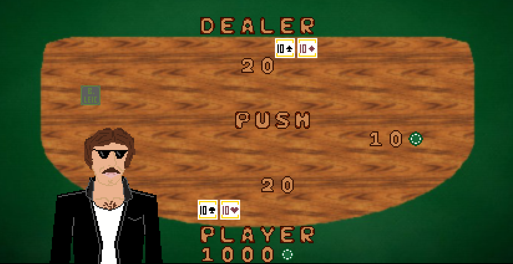

# LDTS_T08_G04 - B.LEICJACK

## Game Description

The BL.EICJACK is the best place for L.EIC students to invest their money. You plays against the dealer. First, you place your bet after which you'll get two cards. Each card has a value (2-10 ranks value the equivalent points, the Jack, the Queen

and the King value 10 points and the Ace can value 1 or 11 points). Your goal is to have more points than the dealer but no more than 21 points because that way you bust! Press the right arrow to hit and draw more cards to your hand, when you feel 

you can't handle any more cards press the left arrow, so you can stand. After you standing, the dealer will draw his cards, he will keep drawing until he reaches a 17 or more points hand, only then you'll know who wins. If both you and

the dealer have the same points the game goes to push mode, only moment you'll get your money back. There are some other special situations like Double, Blackjack, All in, but we'll leave that to the more experienced players. Have fun!   

This project was developed by Carlos Daniel Rebelo (up202108885@edu.fe.up.pt), Diogo Fernandes (up202108752@edu.fe.up.pt) and Pedro Marcelino (up202108754@edu.fe.up.pt) for LDTS 2022-23.

For a more detailed description of our project read this [here](./docs/README.md).

## Gifs and Screenshots

The following gifs/screenshots ilustrate the general look of our game, as well as the multiple features:
### Game preview

  

  <b><i>Gif 1. Sneak peek into BL.EICJACK</i></b>

 
 

### Menu

  

  <b><i>Fig 1. Main Menu </i></b>

  

 
 

  

  <b><i>Gif 2. Rules and Credits </i></b>  

  

 
 

### Game situations

  

  <b><i>Gif 3. All In Round</i></b>

 
 

  

  <b><i>Gif 4. Double bet Round (when you have a hand that values 9, 10 or 11 points if you press 'd' you will double your bet and only get 1 more card) </i></b>

### End Game

  

  <b><i>Fig 2. Win message</i></b>

 
 

  

  <b><i>Fig 3. Lose message</i></b>

 
 

  

  <b><i>Fig 4. Push message</i></b>

 
 

  

  <b><i>Fig 5. Bust message</i></b>

 
 

  

  <b><i>Fig 6. Blackjack message</i></b>

