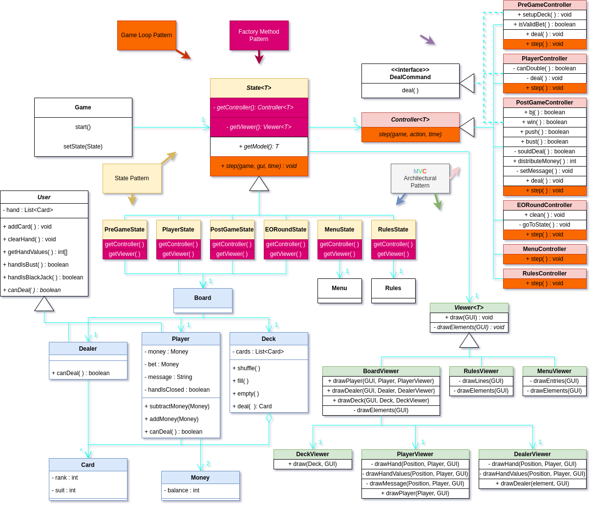
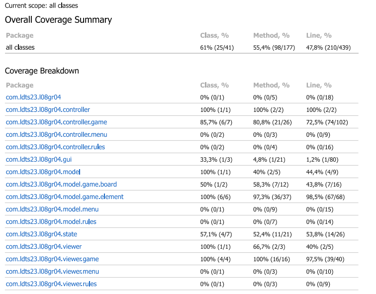

## LDTS08GR04 - BLEICJACK

**UML Class Diagram**

**Main task**

The task given was to develop a text-based game in Java using Lanterna as a GUI framework. Our idea was to develop something a bit different, so we chose (European) Blackjack. Blackjack or Twenty-One is a casino-game that uses from 2 to 8 decks of 52 cards where the player competes against the dealer.
The winner is the one whose hand value is closer to 21.

This project was developed by *Carlos Daniel Rebelo* (*up202108885*@fe.up.pt), *Diogo Fernandes* (*up202108752*@fe.up.pt) and *Pedro Marcelino* (*up202108754*@fe.up.pt) for LDTS 2022⁄23.

### IMPLEMENTED FEATURES

- **CARDS PNG** - We have improved our UI drastically by using sprites to draw our "home-made cards".

- **BET** - Before the play, a player can bet the desired amount.

- **ALL IN** - The player chooses to bet his entire balance.

- **DRAW INITIAL CARDS** - After the bet the player receives two cards facing up.

- **HIT** - A card from the deck will be added to the player's hand.

- **STAND** - The player chooses to not accept any more cards.

- **DOUBLE** - The player chooses to double his bet and only get one more card.

### DESIGN

### Architectural Pattern

- **Problem in Context.** Before starting this project, we knew that we would have to choose the right way to structure our game otherwise it would be much harder to develop more code later.

- **The Pattern.** We decided to choose the **MVC Pattern**. The Model-View-Controller is a design pattern used for developing UI, and it divides its application in three parts. The **model**, only contains the data that is later displayed in the **view**. The **controller** not only receives actions from the **view** but also manipulates the **model** data.

- **Implementation.** 

Our game has an MVC for each one of these:

- [Game](https://github.com/FEUP-LDTS-2022/project-l08gr04/blob/master/src/main/java/com/ldts23/l08gr04/Game.java)
- [Menu](https://github.com/FEUP-LDTS-2022/project-l08gr04/blob/master/src/main/java/com/ldts23/l08gr04/model/menu/Menu.java)
- [Rules](https://github.com/FEUP-LDTS-2022/project-l08gr04/blob/master/src/main/java/com/ldts23/l08gr04/model/rules/Rules.java)
- [Board](https://github.com/FEUP-LDTS-2022/project-l08gr04/blob/master/src/main/java/com/ldts23/l08gr04/model/game/board/Board.java)

In order to clean our code we decided to separate the BoardViewer in the three following viewers:
- [PlayerViewer](https://github.com/FEUP-LDTS-2022/project-l08gr04/blob/master/src/main/java/com/ldts23/l08gr04/viewer/game/PlayerViewer.java)
- [DealerViewer](https://github.com/FEUP-LDTS-2022/project-l08gr04/blob/master/src/main/java/com/ldts23/l08gr04/viewer/game/DealerViewer.java)
- [DeckViewer](https://github.com/FEUP-LDTS-2022/project-l08gr04/blob/master/src/main/java/com/ldts23/l08gr04/viewer/game/DeckViewer.java)

For the same reason, instead of creating a single state for the board we decided to create 4 different states with corresponding controllers:
- [PreGameState](https://github.com/FEUP-LDTS-2022/project-l08gr04/blob/master/src/main/java/com/ldts23/l08gr04/state/PreGameState.java) - [PreGameController](https://github.com/FEUP-LDTS-2022/project-l08gr04/blob/master/src/main/java/com/ldts23/l08gr04/controller/game/PreGameController.java)
- [PlayerState](https://github.com/FEUP-LDTS-2022/project-l08gr04/blob/master/src/main/java/com/ldts23/l08gr04/state/PlayerState.java) - [PlayerController](https://github.com/FEUP-LDTS-2022/project-l08gr04/blob/master/src/main/java/com/ldts23/l08gr04/controller/game/PlayerController.java)
- [PostGameState](https://github.com/FEUP-LDTS-2022/project-l08gr04/blob/master/src/main/java/com/ldts23/l08gr04/state/PostGameState.java) - [PostGameController](https://github.com/FEUP-LDTS-2022/project-l08gr04/blob/master/src/main/java/com/ldts23/l08gr04/controller/game/PostGameController.java)
- [EORState](https://github.com/FEUP-LDTS-2022/project-l08gr04/blob/master/src/main/java/com/ldts23/l08gr04/state/EORState.java) - [EORController](https://github.com/FEUP-LDTS-2022/project-l08gr04/blob/master/src/main/java/com/ldts23/l08gr04/controller/game/EORController.java)

**Consequences.** 
- Excellent for tests
- Easier to modify if needed
- Effortlessly comprehensible

### Deciding Menu / In-Game

**Problem in Context**

Our game has three distinct moments: menu, rules menu or in-game. Each of them has different controllers and displays, so we need to know in which we are to correctly implement it.

**The Pattern**

We chose the **State** pattern to help us implement this with more ease. This pattern helps us represent different states with the help of different subclasses. We can switch to a different state of the application by switching to another subclass. This pattern allows us to improve our code's structure and have specific functions for each state.

**Implementation**

The UML in the begging of this file shows how the pattern’s roles were mapped to the application classes.

These classes can be found in the following files:

- [State](https://github.com/FEUP-LDTS-2022/project-l08gr04/blob/master/src/main/java/com/ldts23/l08gr04/model/game/state/State.java)
- [MenuState](https://github.com/FEUP-LDTS-2022/project-l08gr04/blob/master/src/main/java/com/ldts23/l08gr04/state/MenuState.java)
- [RulesState](https://github.com/FEUP-LDTS-2022/project-l08gr04/blob/master/src/main/java/com/ldts23/l08gr04/state/RulesState.java)
- [PreGameState](https://github.com/FEUP-LDTS-2022/project-l08gr04/blob/master/src/main/java/com/ldts23/l08gr04/state/PreGameState.java)
- [PlayerState](https://github.com/FEUP-LDTS-2022/project-l08gr04/blob/master/src/main/java/com/ldts23/l08gr04/state/PlayerState.java)
- [PostGameState](https://github.com/FEUP-LDTS-2022/project-l08gr04/blob/master/src/main/java/com/ldts23/l08gr04/state/PostGameState.java)
- [EORState](https://github.com/FEUP-LDTS-2022/project-l08gr04/blob/master/src/main/java/com/ldts23/l08gr04/state/EORState.java)

**Consequences**

- No need to use complex if/switch statements.
- More classes.

###  

**Problem in Context**

As we needed a specific controller and viewer for each state we found that the Factory Method pattern would work really well combined with the MVC pattern.

**The Pattern**

The **Factory Method Pattern** allows us to have various subclasses choosing which objects they create, how to manipulate them (through a controller) and display them (through a viewer).

**Implementation**

We created an abstract State class that has as data fields a model, a view and a controller. Each one of the classes that extend this abstract State will be responsible to choose their own concrete model, viewer and controller.

The state classes that implement the abstract State are:

- [MenuState](https://github.com/FEUP-LDTS-2022/project-l08gr04/blob/master/src/main/java/com/ldts23/l08gr04/state/MenuState.java)
- [RulesState](https://github.com/FEUP-LDTS-2022/project-l08gr04/blob/master/src/main/java/com/ldts23/l08gr04/state/RulesState.java)
- [PreGameState](https://github.com/FEUP-LDTS-2022/project-l08gr04/blob/master/src/main/java/com/ldts23/l08gr04/state/PreGameState.java)
- [PlayerState](https://github.com/FEUP-LDTS-2022/project-l08gr04/blob/master/src/main/java/com/ldts23/l08gr04/state/PlayerState.java)
- [PostGameState](https://github.com/FEUP-LDTS-2022/project-l08gr04/blob/master/src/main/java/com/ldts23/l08gr04/state/PostGameState.java)
- [EORState](https://github.com/FEUP-LDTS-2022/project-l08gr04/blob/master/src/main/java/com/ldts23/l08gr04/state/EORState.java)

**Consequences**

- The code permanently deals with a State.
- Each specific state will be in charge of its implementation.
- Each state is independent of the other states.

###  

**Problem in Context**

Event tho Blackjack is a predominantly static game, it depends a lot on user input and repetition of events. Therefore, we needed to find a way to keep our game constantly running, waiting for input when needed and having it ready to go back to
the start of another round, to the menu, etc.

**The Pattern**

The **Game Loop Pattern** helps to provide an interactive way to play a game. It is really easy to conciliate with inputs and a great way to solve the problems of repeating the rounds' behaviour.

**Implementation**

The game loop pattern is present in the following classes:

- [Game](https://github.com/FEUP-LDTS-2022/project-l08gr04/blob/master/src/main/java/com/ldts23/l08gr04/Game.java)
- [State](https://github.com/FEUP-LDTS-2022/project-l08gr04/blob/master/src/main/java/com/ldts23/l08gr04/state/State.java)
- [MenuController](https://github.com/FEUP-LDTS-2022/project-l08gr04/blob/master/src/main/java/com/ldts23/l08gr04/controller/menu/MenuController.java)
- [RulesController](https://github.com/FEUP-LDTS-2022/project-l08gr04/blob/master/src/main/java/com/ldts23/l08gr04/controller/rules/RulesController.java)
- [PreGameController](https://github.com/FEUP-LDTS-2022/project-l08gr04/blob/master/src/main/java/com/ldts23/l08gr04/controller/game/PreGameController.java)
- [PlayerController](https://github.com/FEUP-LDTS-2022/project-l08gr04/blob/master/src/main/java/com/ldts23/l08gr04/controller/game/PlayerController.java)
- [PostGameController](https://github.com/FEUP-LDTS-2022/project-l08gr04/blob/master/src/main/java/com/ldts23/l08gr04/controller/game/PostGameController.java)
- [EORController](https://github.com/FEUP-LDTS-2022/project-l08gr04/blob/master/src/main/java/com/ldts23/l08gr04/controller/game/EORController.java)

**Consequences**

- Perfect combined with user inputs.
- Game doesn't necessarily end after some steps or some time.
- Game is running at all times, if perhaps we wanted to have music or a dynamic background on our game this pattern would make it easier.
- 
###  

**Problem in Context**

**The Pattern**

The **Game Loop Pattern** helps to provide an interactive way to play a game. It is really easy to conciliate with inputs and a great way to solve the problems of repeating the rounds' behaviour.

**Implementation**

The game loop pattern is present in the following classes:

- [Game](https://github.com/FEUP-LDTS-2022/project-l08gr04/blob/master/src/main/java/com/ldts23/l08gr04/Game.java)
- [State](https://github.com/FEUP-LDTS-2022/project-l08gr04/blob/master/src/main/java/com/ldts23/l08gr04/state/State.java)
- [MenuController](https://github.com/FEUP-LDTS-2022/project-l08gr04/blob/master/src/main/java/com/ldts23/l08gr04/controller/menu/MenuController.java)
- [RulesController](https://github.com/FEUP-LDTS-2022/project-l08gr04/blob/master/src/main/java/com/ldts23/l08gr04/controller/rules/RulesController.java)
- [PreGameController](https://github.com/FEUP-LDTS-2022/project-l08gr04/blob/master/src/main/java/com/ldts23/l08gr04/controller/game/PreGameController.java)
- [PlayerController](https://github.com/FEUP-LDTS-2022/project-l08gr04/blob/master/src/main/java/com/ldts23/l08gr04/controller/game/PlayerController.java)
- [PostGameController](https://github.com/FEUP-LDTS-2022/project-l08gr04/blob/master/src/main/java/com/ldts23/l08gr04/controller/game/PostGameController.java)
- [EORController](https://github.com/FEUP-LDTS-2022/project-l08gr04/blob/master/src/main/java/com/ldts23/l08gr04/controller/game/EORController.java)

**Consequences**

- Perfect combined with user inputs.
- Game doesn't necessarily end after some steps or some time.
- Game is running at all times, if perhaps we wanted to have music or a dynamic background on our game this pattern would make it easier.

### KNOWN CODE SMELLS AND REFACTORING SUGGESTIONS

------
**Switch Statements**

To get the desired type of the controller and state classes, we have used switch statements. In situations in which we have to deal with multiple conditions the code tends do get less comprehensible and more complex.
A way to improve this could be via **Substitute Algorithm** refactor, there might be a clearer logic that tests all the conditions we have inside our switch statements.  

------
**Temporary Fields**

In the player class we created the fields 'message' and 'handIsClosed' that, although they aren't constantly necessary, make the code easier to understand.
This code smell could possibly be removed with the **Replace Temp With Query** refactor, although we struggled to do so. 

------
**Data Class**

This code smell is present in the Card class as we basically only have data fields and get functions.
Even though it's true that the Card class is a small object, and it's not changed after its creation we don't find the **Change Reference to value** refactor to be fitting as having the Card class presents easier to understand code.

------
**Feature Envy**

In the game controller classes we tend to access and manipulate the model classes data much more often than their own. 

------

### TESTING

 
 

  

  <b><i>Coverage Report </i></b>  

  

 
 

 
 

  

  <b><i>Mutation Testing Report </i></b>  

  

 
 

- [Mutation testing report](PIT-report/index.html).

### SELF-EVALUATION

The three of us worked very hard to make the most out of this project as possible. We have developed our teamwork skills, Git skills and also gained knowledge on Design Patterns, Refactorings, Code Smells, and many other important concepts.\
We evaluate ourselves equally.

- Carlos Daniel Rebelo : 33%
- Diogo Fernandes : 33%
- Pedro Marcelino : 33%
